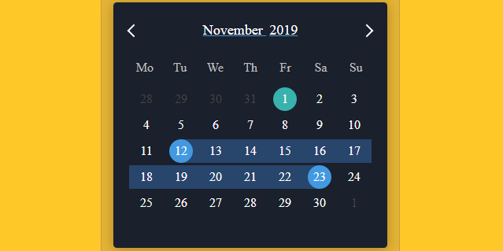

# Introduction to Functional Calendar

Modern calendar and datepicker module for Vue.js

## What is Vue.js Functional Calendar

* Lightweight, high-performance calendar component based on Vue.js
* Small memory usage, good performance, good style, and high scalability
* Native js development, no third-party library introduced
* Date Picker, Date Range, Multiple Calendars, Modal Calendar

## Browser Support
 |  |  |  |  |  |
--- | --- | --- | --- | --- | --- |
 39+ ✔ | 28+ ✔ | 10.1+ ✔ | 27+ ✔ | 15+ ✔ | Latest ✔ |